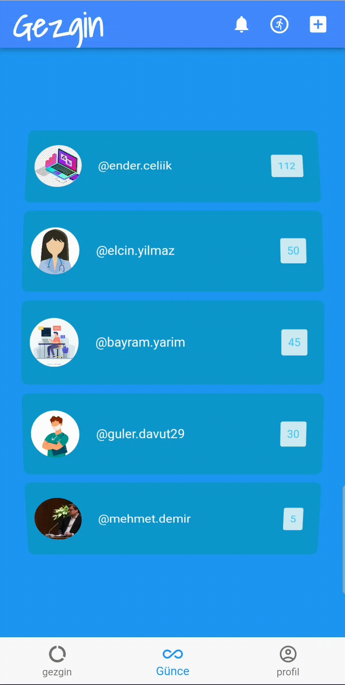

  
# Gezgin-App
> Social media/contest application focused on human health with Flutter.

The aim of the project is to redirect people's inclination to showcase and share aspects of their lives (such as ideas, scenery, breakfast, newly acquired watches) on social media platforms towards their walking statistics, which symbolize their health. By organizing competitions based on these statistics, the goal is to improve public health and slow down global warming by reducing exhaust emissions.

> ## Features:
> You can follow people:
> |  |
> | -- |
> 
> Share journal entries with attached current location:
>|  |  |
>| -- | -- |
>
> View/Like the journal entries of people you follow:
> |  |
> | -- |